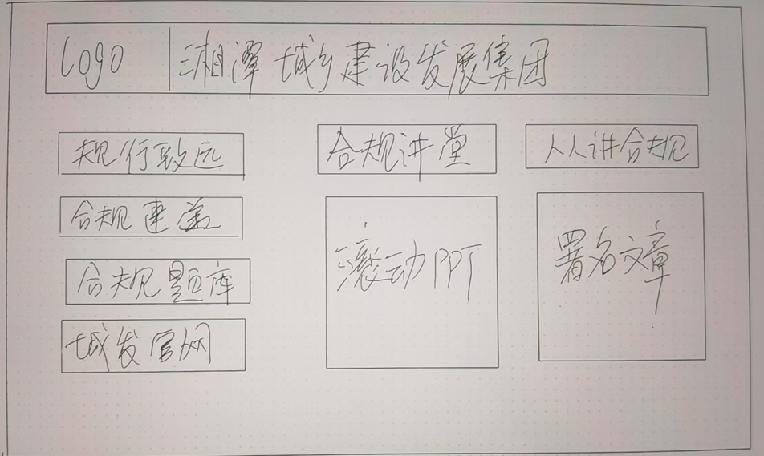

# 背景
为了更好地宣传合规文化，湘潭城发集团决定设计一个合规宣传页面。需要设计一个简洁、美观、易于使用的网页，展示合规相关内容。页面需要包含动态图片和多个板块，以便用户能够快速获取所需信息。

# 页面设计

# 设计要求

界面有湘潭城发集团和规行致远合规品牌的 logo  
界面有动态的图片，页面不至于呆板  
五个板块  
1、人人讲合规（署名文章）  
2、合规速递（合规政策法规）  
3、合规课堂（合规 ppt 内容）  
4、城发动态（城发集团官网链接: http://www.xtcfjt.com/）  
5、合规题库（合规试题）  

# 技术要求
## 页面逻辑设计
- `office_files.json`中包含了很多pdf文件的路径和相关信息，
- 页面五个版块支持跳转，跳转后在新的页面显示pdf文件

## 页面设计
- 使用 HTML、CSS 和 JavaScript 技术实现页面设计
- 页面要模仿PowerPoint的风格，简洁、美观
- 使用PowerPoint的页面尺寸, 并在页面跳转的时候模仿其切换幻灯片的效果
- 页面上的按钮要有动态效果，使用 JavaScript 实现